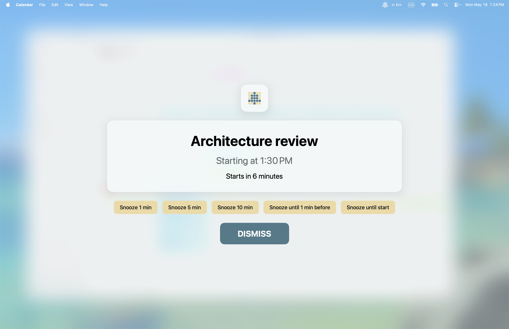

# Hey Listen

**Full-screen calendar alerts you can't miss.**

Hey Listen is a macOS menu bar app that shows full-screen reminders before your calendar events start. It detects meeting links, supports flexible snooze options, and gives you granular control over which events alert you and when.

---

## User Guide

For detailed documentation, visit the **[Hey Listen User Guide](guide/README.md)**.

| | |
|---|---|
| [Getting Started](guide/getting-started.md) | Install, connect calendars, and get your first alert |
| [Alerts](guide/alerts.md) | Configure when and how alerts appear |
| [Calendars](guide/calendars.md) | Choose which calendars to monitor |
| [Menu Bar](guide/menu-bar.md) | Customize the menu bar label and event list |
| [Snooze](guide/snooze.md) | Snooze options and how they work |
| [Muting](guide/muting.md) | Silence alerts for specific events or title patterns |
| [Filtering](guide/filtering.md) | Filter by RSVP status or work hours |
| [Purchasing](guide/purchasing.md) | Free trial and one-time purchase |

---

## Support

For detailed documentation, see the [User Guide](guide/README.md).

If you need help, have a feature request, or want to report a bug, please contact me at [heylisten@arbitrarystudios.com](mailto:heylisten@arbitrarystudios.com).

---

## Privacy

Hey Listen operates entirely offline. It accesses your calendar data locally and never transmits it. No accounts, no analytics, no tracking. Read the full [privacy policy](PRIVACY.md).
