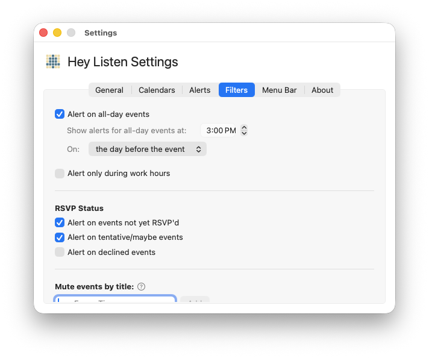
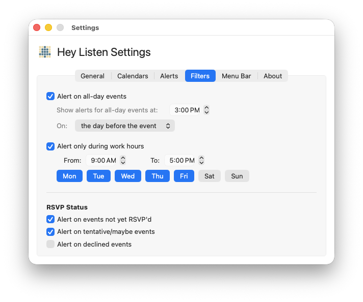
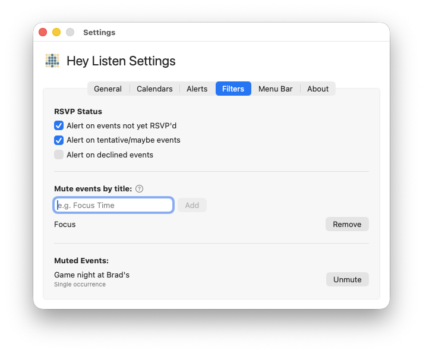

# Filtering

Hey Listen can filter out events by type, RSVP status, or time of day. All filtering options live in **Settings → Filters**.

---

## All-Day Events

By default, Hey Listen does not alert on all-day events (birthdays, holidays, and similar). Turn on **Alert on all-day events** in **Settings → Filters** if you want them included.

When enabled, configure when the alert fires:

- **Time** — the time of day you want to be alerted (for example, 8:00 AM)
- **On** — whether the alert fires the **day of** the event or **the day before**

---

## Work Hours

Limit alerts to your working hours so you're not disturbed in the evening, on weekends, or any time outside your defined schedule.

Enable this with the **Alert only during work hours** toggle in **Settings → Filters**.

### Configuring work hours

Once enabled, set:

- **From / To** — Your start and end times for receiving alerts
- **Days** — Toggle each weekday button on or off (Mon through Sun)

**Example:** 9:00 AM to 6:00 PM, Monday through Friday. An event on Saturday or at 7:00 PM on a weekday will not trigger an alert.

### Events outside work hours

Work hours filtering applies at the moment the alert would fire — based on the event's start time minus your configured alert lead time. An event starting at 8:55 AM with a 5-minute lead time would alert at 8:50 AM. If 8:50 AM is outside your work hours, no alert fires.

---

## RSVP Filtering

Control which events alert you based on how you've responded to them. These toggles are in **Settings → Filters** under the **RSVP Status** heading.

| Toggle | Default | What it controls |
|---|---|---|
| Alert on events not yet RSVP'd | On | Events you haven't responded to yet |
| Alert on tentative/maybe events | On | Events you accepted as tentative |
| Alert on declined events | Off | Events you explicitly declined |

Events where you're the organizer (no RSVP required) always alert.

**Example configurations:**

- *Only alert on events you've accepted:* Turn off "not yet RSVP'd" and "tentative" — you'll only see alerts for events you've confirmed.
- *Alert on everything:* Turn on all three, including declined events. Useful if you sometimes attend meetings you technically declined.

---

## Muting vs. Filtering

Filtering applies broad rules to categories of events automatically. [Muting](muting.md) lets you silence specific events by name or individually. The two work together — a muted event won't alert even if it would otherwise pass all filters.

---

← [Guide Index](README.md)
