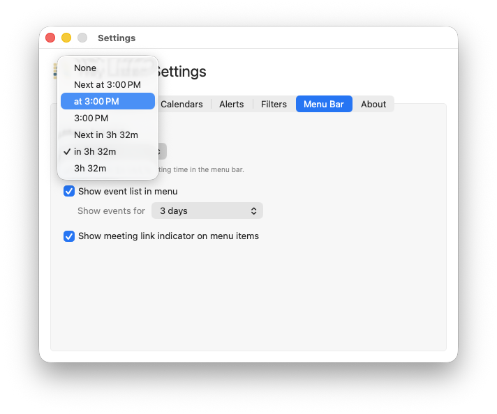
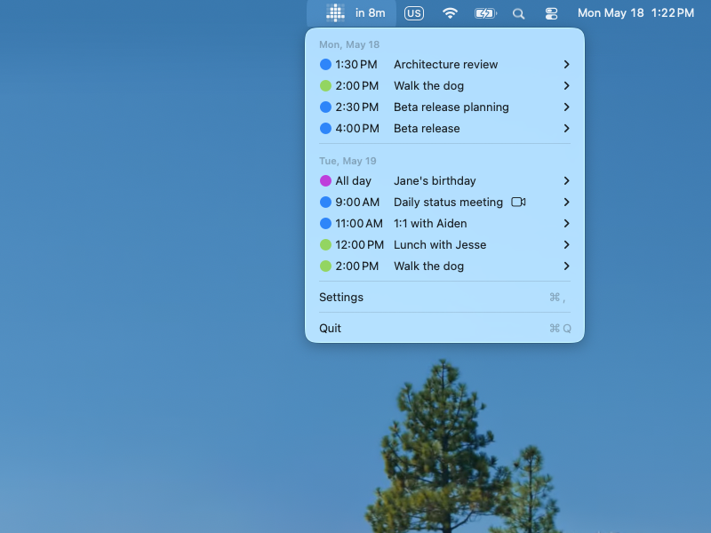
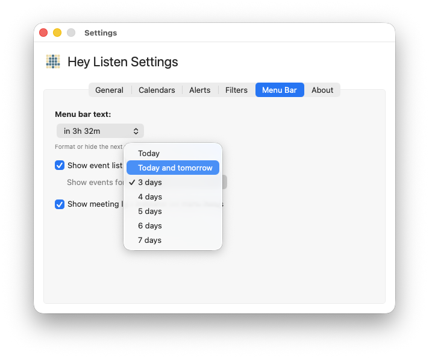
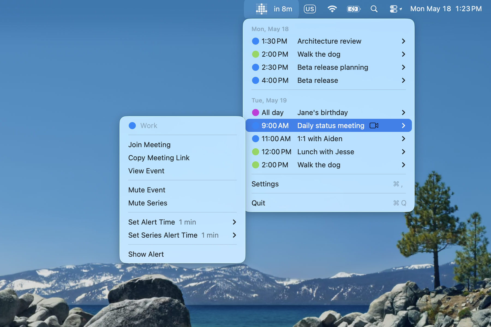
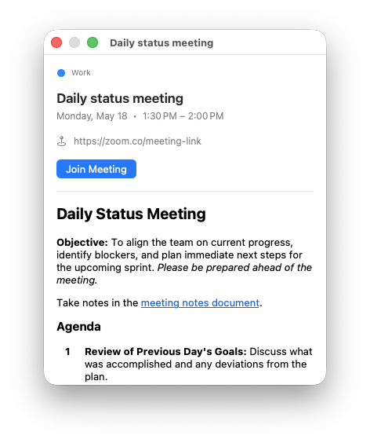
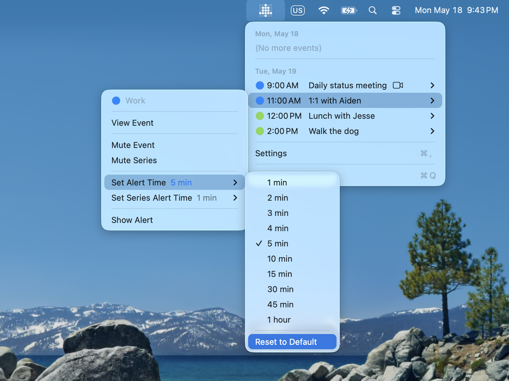

# Menu Bar

Customize what Hey Listen shows next to its icon and in the dropdown menu.

---

## Menu Bar Label

Hey Listen can display information about your next meeting directly in the menu bar, next to its icon. Configure this in **Settings → Menu Bar** using the **Menu bar text** picker.

### Label formats

| Format | Example |
|---|---|
| None | *(icon only)* |
| Next at [time] | `Next at 3:00 PM` |
| at [time] | `at 3:00 PM` |
| [time] | `3:00 PM` |
| Next in [duration] | `Next in 3h 32m` |
| in [duration] | `in 3h 32m` |
| [duration] | `3h 32m` |

### In-progress events

When a meeting is currently in progress and your next event doesn't start for at least 10 minutes, the label automatically switches to show time remaining in the current event — for example, `14m left` or `1h 2m left`.

---

## Event List

When **Show event list in menu** is enabled (the default), clicking the Hey Listen icon shows your upcoming events grouped by day. Toggle this off in **Settings → Menu Bar** if you only want the icon and label.

### Event range

Use the **Show events for** picker to control how far ahead the event list looks. Options range from Today only up to 7 days.

Events for today that have already ended are hidden from the list.

---

## Calendar Color Dots

When two or more calendars are selected for monitoring, each event in the menu list shows a color dot matching its calendar. This helps you tell events apart at a glance when multiple calendars are active.

---

## Event Submenus

Click any event in the menu to open its submenu. From here you can:

### Join or copy a meeting link

If a meeting link is detected, **Join Meeting** opens it immediately. **Copy Meeting Link** puts the URL on your clipboard.

### View event details

**View Event** opens a detail panel with the full event title, time, location, description, and attendee list.

### Mute or unmute

**Mute Event** silences the alert for this specific occurrence. **Mute Series** silences all future occurrences of a recurring event. These options also appear as **Unmute Event** and **Unmute Series** when the event is already muted.

See [Muting](muting.md) for more.

### Set a custom alert time

**Set Alert Time** overrides the alert timing for this single event occurrence. For recurring events, **Set Series Alert Time** applies the override to the whole series.

A checkmark shows the currently active time. The label shows whether the time is a custom override (shown in accent color) or the inherited default (shown in gray).

Select **Reset to Default** to remove the override.

---

## Time Format

The time format used throughout the app — in the menu bar label, event list, and alert window — is set in **Settings → General**.

| Option | Example |
|---|---|
| System Default | follows macOS locale setting |
| 12-hour | `3:00 PM` |
| 24-hour | `15:00` |

---

← [Guide Index](README.md)
