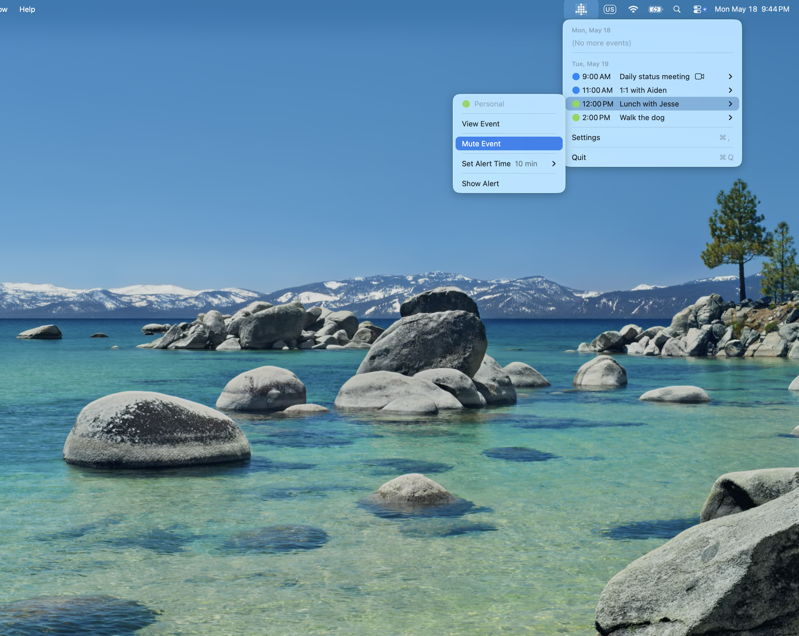
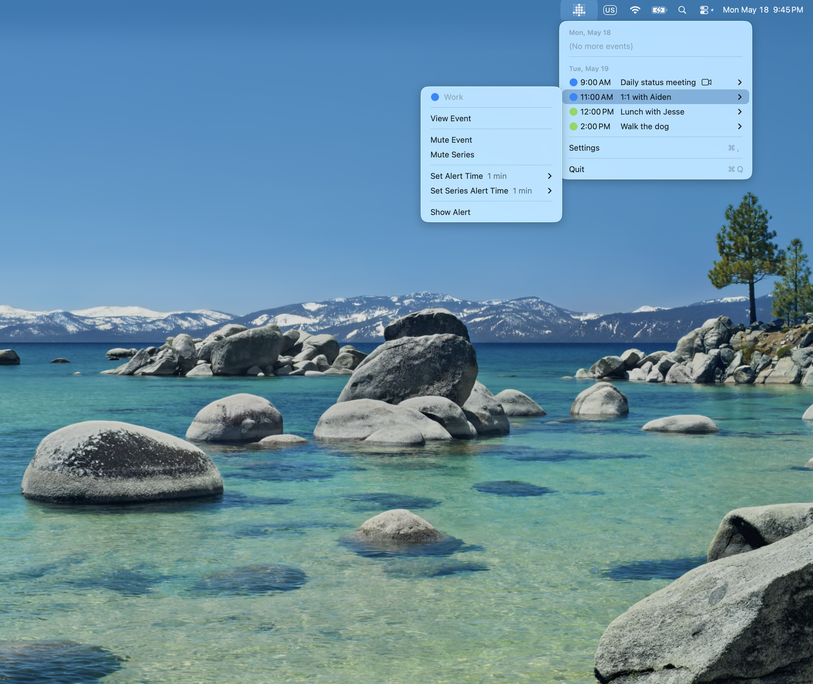
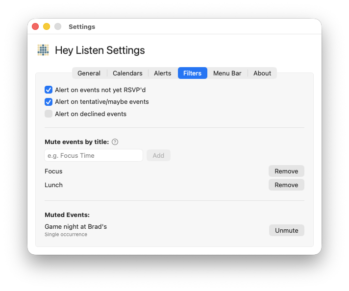

# Muting

Muting lets you silence alerts for events you don't need reminders for — without removing them from your calendar or deselecting their calendar entirely.

---

## Mute a Single Event

To silence the alert for one specific occurrence of an event, open the menu bar, click the event to open its submenu, then click **Mute Event**.

Muted events appear grayed out in the menu bar event list as a reminder that their alerts are silenced.

---

## Mute an Entire Series

For recurring events, you can mute all future occurrences at once. Open the event's submenu in the menu bar and click **Mute Series**.

---

## Mute by Title Pattern

If there are categories of events you never want alerts for — like "Focus Time" blocks, birthday reminders, or "No Meeting" holds — you can add a title pattern to mute any event whose title contains that text.

Go to **Settings → Filters** and find the **Mute events by title** section:

1. Type the text to match (case-insensitive) into the field
2. Press Enter or click **Add**

Any event whose title contains your pattern will be silently skipped — no alert will appear. The match is a simple substring search; there's no need for wildcards.

**Examples:**
- `Focus Time` — mutes any event with "Focus Time" in the title
- `Birthday` — mutes birthday calendar entries
- `Lunch` — mutes lunch blocks

To remove a pattern, click **Remove** next to it.

---

## Unmuting

### Unmute from the menu bar

Click the event in the menu and select **Unmute Event** or **Unmute Series**.

### Unmute from Settings

Open **Settings → Filters** and scroll to the **Muted Events** section. Muted series and individual occurrences are listed here. Click **Unmute** next to any item to restore its alerts.

---

## Muting vs. Filtering

Muting is per-event or per-title — you're silencing specific events you've identified.

[Filtering](filtering.md) (all-day events, RSVP status, work hours) applies broad rules to whole categories of events. Use filtering when you want to exclude a class of events by rule, and muting when you want to handle specific events individually.

---

← [Guide Index](README.md)
